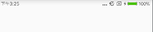

# StatusBarUtil

### 设置主题


**注意：** 要设置fitsSystemWindows为true

``` stylus
<style name="AppTheme" parent="Theme.AppCompat.Light.NoActionBar">
        <!-- Customize your theme here. -->
        <item name="android:fitsSystemWindows">true</item>
        <item name="colorPrimary">@color/colorPrimary</item>
        <item name="colorPrimaryDark">@color/colorPrimaryDark</item>
        <item name="colorAccent">@color/colorAccent</item>
    </style>
```
### 方法
```
 设置字体颜色为黑色
 setImmersiveStatusBar(Activity activity,boolean fontIconDark)
 设置状态栏透明
 setTranslucentStatus(Activity activity)
 设置状态栏的颜色
 setStatusBarColor(Activity activity, int colorId)
```
### 使用方式
``` stylus
public class MainActivity extends AppCompatActivity {

    @Override
    protected void onCreate(Bundle savedInstanceState) {
        super.onCreate(savedInstanceState);
        setContentView(R.layout.activity_main);
        StatusBarUtil.setImmersiveStatusBar(this,true);
    }
}
```
### 效果显示


[详细解析][1]


  [1]: https://fessible.github.io/2018/01/13/%E7%8A%B6%E6%80%81%E6%A0%8F%E5%B7%A5%E5%85%B7/


